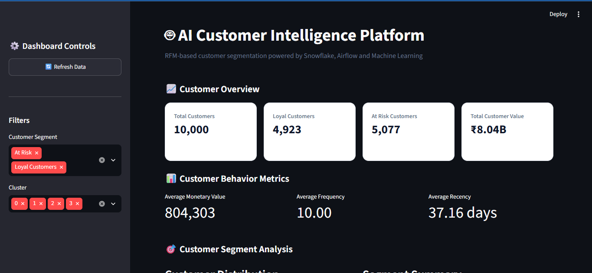
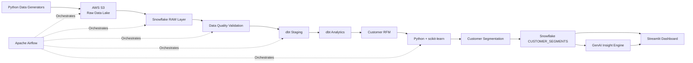
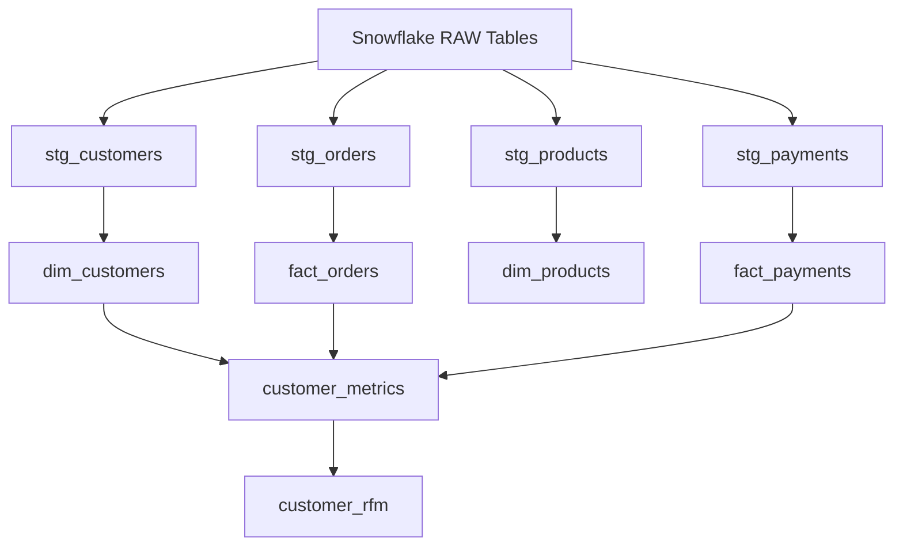
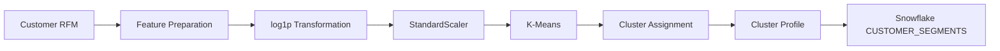
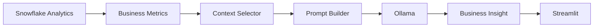
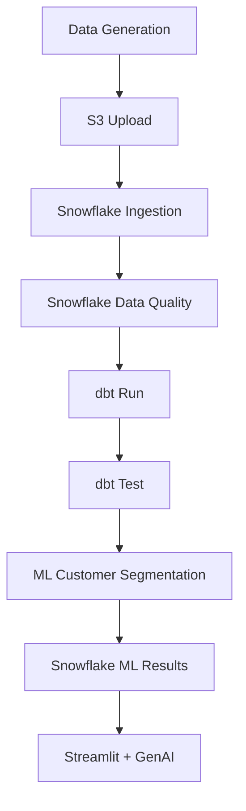

# AI Customer Intelligence Platform

> An end-to-end customer analytics platform that combines **AWS S3, Snowflake, dbt, Apache Airflow, Python/scikit-learn, local GenAI with Ollama, and Streamlit** to turn raw customer transactions into actionable customer intelligence.



---

## 📌 Project Overview

The **AI Customer Intelligence Platform** is a portfolio-grade end-to-end data engineering and analytics project designed to demonstrate how a modern data pipeline can move from raw data ingestion to analytics, machine learning, GenAI-assisted business insights, and an interactive dashboard.

The platform processes customer, order, product, and payment data through a layered architecture:

**Data Generation → AWS S3 → Snowflake → Data Quality → dbt → RFM Analytics → ML Customer Segmentation → GenAI Insight Engine → Streamlit Dashboard**

The project is intentionally designed to run with **free/open-source software where possible** and without Docker, making it suitable for a resource-constrained local development environment.

---

## 🎯 Business Problem

Businesses often have large amounts of customer transaction data but need a reliable way to answer questions such as:

- Which customers are at risk of churn?
- Which customers are highly engaged?
- Which customers are the most valuable?
- Which customer segment should receive retention campaigns?
- Which ML cluster represents high-value customers?
- How can customer behavior be translated into actionable business recommendations?

This platform addresses these questions by combining:

1. **Reliable data ingestion**
2. **Data quality validation**
3. **Cloud data warehousing**
4. **SQL-based transformation and analytics**
5. **RFM customer analysis**
6. **Machine learning segmentation**
7. **GenAI-assisted insight generation**
8. **Interactive business visualization**
9. **Workflow orchestration**

---

## 📋 Business Requirements

The platform was designed around the following business requirements:

| Requirement | Solution |
|---|---|
| Generate realistic customer transaction data | Python + Faker |
| Store raw data reliably | AWS S3 |
| Validate incoming data | Python data-quality layer |
| Separate invalid records | Quarantine process |
| Build analytical datasets | Snowflake + dbt |
| Understand customer purchasing behavior | RFM analysis |
| Segment customers automatically | K-Means clustering |
| Persist ML results for analytics | Snowflake |
| Generate business-oriented insights | Hybrid analytical + GenAI engine |
| Provide interactive visualization | Streamlit |
| Automate pipeline execution | Apache Airflow |

---

# ⭐ Key Features

### Data Engineering

- Synthetic customer, order, product and payment data generation
- AWS S3-based raw data lake
- Snowflake data warehouse
- Data-quality validation
- Invalid-record quarantine
- Reusable Python ingestion utilities

### Analytics

- dbt staging and analytical models
- Customer metrics
- RFM analysis
- Customer behavior analysis

### Machine Learning

- K-Means customer segmentation
- RFM-based feature engineering
- Log transformation
- Feature standardization
- Silhouette Score and Inertia evaluation
- Customer cluster profiling

### GenAI

- Business-question-driven insight generation
- Context selection
- Prompt engineering
- Local LLM inference using Ollama
- Qwen2.5 1.5B
- Hybrid deterministic + GenAI architecture
- Safe fallback when local LLM inference is slow

### Visualization

- Interactive Streamlit dashboard
- Customer overview KPIs
- Segment analysis
- Cluster analysis
- Top customer analysis
- AI Business Insights
- AI Executive Summary

### Orchestration

- Apache Airflow DAG-based pipeline orchestration
- End-to-end pipeline execution
- Pipeline component testing
- Dependency-based workflow execution

---

# 🏗️ High-Level Architecture



### Main data flow

```text
Python Generators
      │
      ▼
   AWS S3
      │
      ▼
Snowflake RAW
      │
      ▼
Data Quality
      │
      ▼
 dbt Staging
      │
      ▼
dbt Analytics
      │
      ├──────────────► Customer Metrics
      │
      ▼
 Customer RFM
      │
      ▼
ML Segmentation
      │
      ▼
CUSTOMER_SEGMENTS
      │
      ├──────────────► Streamlit Dashboard
      │
      └──────────────► GenAI Insight Engine
```

---

## 🧩 Core Components

| Layer | Technology | Purpose |
|---|---|---|
| Data Generation | Python, Faker | Generate realistic customer/business data |
| Data Lake | AWS S3 | Store raw/validated/quarantined data |
| Data Warehouse | Snowflake | Central analytical data platform |
| Data Quality | Python | Validate data and quarantine invalid records |
| Transformation | dbt | Build staging and analytical models |
| Orchestration | Apache Airflow | Automate and coordinate pipeline tasks |
| Analytics | SQL/dbt | Customer metrics and RFM features |
| Machine Learning | Python, scikit-learn | Customer clustering/segmentation |
| GenAI | Ollama, Qwen2.5 1.5B | Generate natural-language business insights locally |
| Application | Streamlit | Interactive customer intelligence dashboard |

---

# 🔄 End-to-End Pipeline

## 1. Data Generation

The project generates synthetic business data for:

- Customers
- Orders
- Products
- Payments

Python/Faker is used so that the complete pipeline can be demonstrated without exposing real customer information.

Example scale used during development:

- **10,000 customers**
- **100,000 orders**

The generated data is used as the input for downstream ingestion and analytics.

---

## 2. AWS S3 Data Lake

S3 is used as the raw landing layer.

Conceptually, the data is organized into:

```text
S3
├── raw/
├── validated/
└── quarantine/
```

The raw layer preserves incoming data, while validated and quarantine areas support data-quality processing.

---

## 3. Snowflake Data Warehouse

Snowflake is used as the central analytical warehouse.

The project uses:

```text
AI_CUSTOMER_DB
```

with the analytical schema:

```text
AI_CUSTOMER_DB.ANALYTICS
```

The platform uses Snowflake for:

- Raw data storage
- Data-quality analysis
- dbt transformations
- Customer analytics
- RFM features
- ML segmentation persistence
- Business insight queries

---

# 🧪 Data Quality

Data quality is treated as a separate pipeline concern rather than assuming that all incoming data is valid.

The project includes Python utilities for:

- Data validation
- Injecting test data issues
- Quarantining invalid records

The goal is to prevent poor-quality records from silently flowing into the analytical layer.

Typical validation concerns include:

- Required identifiers
- Missing values
- Invalid relationships
- Invalid business values
- Duplicate/invalid records

---

# 🔧 dbt Transformation Layer

The dbt project is located under:

```text
ai_customer_dbt/
```

### Staging models

```text
stg_customers
stg_orders
stg_products
stg_payments
```

### Analytics models

```text
dim_customers
dim_products
fact_orders
fact_payments
customer_metrics
customer_rfm
```

The dbt layer separates raw warehouse data from business-ready analytical models.

### Simplified dbt flow



---

# 📊 RFM Customer Analytics

The platform calculates three core customer behavior features:

### Recency

How recently the customer made a purchase.

```text
RECENCY_DAYS
```

Lower recency generally represents more recent engagement.

### Frequency

How frequently the customer purchases.

```text
FREQUENCY
```

### Monetary Value

The customer's total monetary contribution.

```text
MONETARY_VALUE
```

These features form the foundation for customer segmentation.

---

# 🤖 Machine Learning Customer Segmentation

The project uses **scikit-learn K-Means clustering** on RFM features.

### ML pipeline



### Model evaluation

Multiple K values are evaluated:

```text
K = 2 to 6
```

The project evaluates clustering using:

- Silhouette Score
- Inertia

A fixed random state is used for reproducibility.

The resulting outputs include:

```text
ml/output/
├── model_evaluation.csv
├── cluster_profile.csv
└── customer_segments.csv
```

---

# 🧠 GenAI Insight Engine

The GenAI layer converts verified customer analytics into natural-language business insights.

The architecture is intentionally designed so that GenAI does **not** directly query arbitrary raw data.

Instead:



### Components

```text
genai/
├── business_metrics.py
├── context_selector.py
├── insight_engine.py
├── ollama_client.py
└── prompt_builder.py
```

### Local model

The development environment uses:

```text
Ollama
└── qwen2.5:1.5b
```

This keeps the GenAI component local and avoids depending on a paid external LLM API.

---

# ⚠️ GenAI / Ollama Limitations

The local GenAI component is constrained by the development hardware.

The selected model can sometimes take significantly longer to respond to larger or more open-ended prompts.

For this reason, the project uses a **hybrid insight architecture**:

```text
Supported analytical questions
        │
        ▼
Deterministic / verified insight logic
        │
        ▼
Fast business answer

Other questions
        │
        ▼
Local GenAI fallback
        │
        ├── Successful response → return insight
        │
        └── Timeout → safe fallback message
```

This design is intentional.

The analytical insight engine remains usable even when local LLM inference is slow.

### Data safety principle

The prompt builder instructs the model to:

- Use only verified data
- Avoid inventing numerical values
- Avoid modifying provided values
- Avoid unsupported statistics
- Separate findings from recommendations
- State when available data is insufficient
- Avoid numerical business-impact claims

This makes the GenAI component an **insight-generation layer**, not the system of record.

---

# 📈 Streamlit Dashboard

The Streamlit application provides an interactive business-facing interface.

Current dashboard capabilities include:

- Customer overview KPIs
- Customer segment filters
- Cluster filters
- Customer behavior metrics
- Segment distribution
- Segment summary
- ML cluster analysis
- Top customers by monetary value
- AI Business Insights
- AI Executive Summary

### Dashboard KPIs

The current dataset can display metrics such as:

```text
Total Customers       10,000
Loyal Customers        4,923
At Risk Customers      5,077
Total Customer Value   ₹8.04B
```

The dashboard values are dynamically calculated from the filtered Snowflake customer segmentation data.

---

## 🖥️ Dashboard Preview

The repository screenshot should be stored at:

```text
docs/images/dashboard.png
```

and displayed here:


---

# 🔄 Airflow Orchestration

Apache Airflow is used to coordinate the pipeline.

### Main project DAGs

```text
dags/
├── customer_data_pipeline.py
├── snowflake_ingestion_pipeline.py
├── snowflake_data_quality.py
├── dbt_transformation_pipeline.py
├── ml_customer_segmentation_pipeline.py
└── end_to_end_customer_pipeline.py
```

### Supporting/testing DAGs

```text
airflow_test_dag.py
s3_connectivity_dag.py
snowflake_connection_test.py
ml_snowflake_test.py
ml_customer_segmentation_test.py
```

These supporting DAGs were used for development and component verification.

### End-to-end orchestration

The overall concept is:



---

# 📁 Project Structure

```text
AI-Customer-Intelligence-Platform/
│
├── ai_customer_dbt/
│   ├── models/
│   │   ├── staging/
│   │   └── analytics/
│   ├── macros/
│   ├── dbt_project.yml
│   └── README.md
│
├── dags/
│   ├── customer_data_pipeline.py
│   ├── dbt_transformation_pipeline.py
│   ├── end_to_end_customer_pipeline.py
│   ├── ml_customer_segmentation_pipeline.py
│   ├── snowflake_data_quality.py
│   ├── snowflake_ingestion_pipeline.py
│   └── supporting/test DAGs
│
├── genai/
│   ├── business_metrics.py
│   ├── context_selector.py
│   ├── insight_engine.py
│   ├── ollama_client.py
│   └── prompt_builder.py
│
├── ml/
│   ├── rfm_segmentation.py
│   ├── snowflake_writer.py
│   └── output/
│
├── src/
│   ├── aws/
│   │   └── s3/
│   ├── data_quality/
│   └── generators/
│
├── streamlit_app/
│   ├── app.py
│   └── snowflake_connection.py
│
├── requirements.txt
└── README.md
```

---

# 🛠️ Technology Stack

### Data Engineering

- Python
- SQL
- AWS S3
- Snowflake
- Apache Airflow
- dbt

### Machine Learning

- Python
- pandas
- scikit-learn
- K-Means
- RFM analysis

### GenAI

- Ollama
- Qwen2.5 1.5B
- Prompt engineering
- Rule-based/hybrid insight generation

### Application

- Streamlit

### Development Environment

- WSL2 Ubuntu
- Python virtual environment
- Git/GitHub
- No Docker

---

# 💡 What This Project Demonstrates

This project demonstrates practical implementation of a modern end-to-end
data engineering and customer intelligence platform.

Key engineering capabilities demonstrated include:

- Designing an end-to-end data pipeline
- Building a cloud data lake using AWS S3
- Loading and analyzing data in Snowflake
- Implementing data-quality validation and quarantine
- Developing reusable Python utilities
- Building staging and analytical transformations using dbt
- Designing analytical fact and dimension models
- Implementing RFM customer analytics
- Applying machine learning for customer segmentation
- Evaluating K-Means clustering using Silhouette Score and Inertia
- Persisting ML results into Snowflake
- Orchestrating data workflows using Apache Airflow
- Building a hybrid analytical and GenAI insight architecture
- Integrating a local LLM using Ollama
- Handling local GenAI performance limitations
- Building an interactive Streamlit business dashboard
- Translating analytical results into business-oriented recommendations

The project also demonstrates an important engineering principle:

> AI should enhance verified analytical data rather than replace the
> underlying data and analytical systems.

---

# 💻 Local Development Constraints

The project was designed for a resource-constrained laptop environment.

Important constraints included:

- 8 GB RAM
- 256 GB SSD
- No Docker
- Preference for free/open-source software
- Avoidance of expensive managed infrastructure where possible

Because of these constraints:

- Airflow runs locally in WSL2.
- Ollama runs locally.
- A small local LLM is used.
- The GenAI layer has timeout/fallback handling.
- The architecture avoids unnecessary heavyweight services.

These constraints influenced several engineering decisions in the project.

---

# 🚀 Setup

## 1. Clone the repository

```bash
git clone https://github.com/Jayant0209/AI-Customer-Intelligence-Platform.git
cd AI-Customer-Intelligence-Platform
```

## 2. Create a virtual environment

```bash
python3 -m venv .venv
source .venv/bin/activate
```

## 3. Install dependencies

```bash
pip install -r requirements.txt
```

## 4. Configure AWS

Configure AWS credentials using your preferred secure method.

Do **not** commit credentials to GitHub.

The project uses AWS S3 for the data-lake layer.

## 5. Configure Snowflake

Configure the Snowflake connection required by the application and pipeline.

The project uses:

```text
Database: AI_CUSTOMER_DB
Analytics Schema: ANALYTICS
```

Never commit passwords, private keys, access tokens, or other secrets.

## 6. Install and start Ollama

Install Ollama separately and pull the model:

```bash
ollama pull qwen2.5:1.5b
```

Verify:

```bash
ollama list
```

## 7. Run Streamlit

```bash
streamlit run streamlit_app/app.py
```

## 8. Run Airflow

Airflow should be initialized/configured according to the local environment before starting the scheduler/API components.

The project was developed using Airflow in WSL2 rather than Docker.

---

# 🔐 Security Considerations

The repository intentionally excludes environment-specific and sensitive files.

Never commit:

```text
AWS access keys
AWS secret keys
Snowflake passwords
Private keys
API tokens
.env files containing secrets
Airflow metadata databases
Local virtual environments
Runtime logs
```

Use environment variables, Airflow connections, or another secure secret-management mechanism instead.

---

# 🧪 Validation & Testing

The project includes component-level validation for:

- S3 connectivity
- Snowflake connectivity
- Data-quality validation
- ML/Snowflake integration
- Customer segmentation
- Airflow DAG execution
- dbt model/test execution
- GenAI insight generation

Python syntax can be checked with:

```bash
python -m py_compile <file.py>
```

---

# 📌 Current Project Results

The current development dataset produced:

### Customer base

```text
Customers: 10,000
Orders:    100,000
```

### Customer segments

```text
At Risk:         5,077
Loyal Customers: 4,923
```

### Overall customer metrics

```text
Average Recency:    37.16 days
Average Frequency:  10.00
Total Customer Value: approximately ₹8.04B
```

### ML clusters

The segmentation pipeline evaluated K values from **2 through 6** and generated cluster profiles and evaluation metrics.

One observed high-value cluster in the current development output is:

```text
Cluster ID: 3
Customers: 2,721
Average Monetary Value: 1,189,700.37
Average Recency: 25.35 days
Average Frequency: 13.59
```

These figures are based on the current synthetic development dataset and should not be interpreted as real customer/business results.

---

# 💡 Example Business Questions

The analytical insight engine supports questions such as:

```text
Which customer segment should we target for retention?

Which cluster has the highest customer value?

What can we do to improve customer loyalty?

Which customers need immediate attention?

Which customers are most valuable?

Which customers are most engaged?

Which customers are showing signs of churn?
```

The dashboard returns verified findings and recommended actions based on the available analytical data.

---

# ⚠️ Project Limitations

This is a portfolio/development implementation rather than a production enterprise deployment.

Current limitations include:

1. Data is synthetic.
2. Airflow runs locally.
3. Ollama inference performance depends on local hardware.
4. The local Qwen2.5 1.5B model is intentionally small.
5. GenAI is constrained to verified analytical context.
6. The dashboard is not deployed as a production application.
7. No enterprise secrets-management platform is integrated.
8. No distributed ML infrastructure is required for the current dataset.
9. Business impact is described qualitatively rather than estimated with unsupported numerical claims.

---

# 🔮 Future Enhancements

Possible future production-oriented improvements include:

- Move orchestration to managed Airflow
- Add incremental dbt models
- Add automated data-quality reporting
- Add stronger observability and alerting
- Add data lineage documentation
- Add model monitoring
- Add customer churn prediction
- Add recommendation models
- Add product-level affinity analysis
- Replace local LLM with a production LLM endpoint when appropriate
- Add API-based access to customer insights
- Add role-based dashboard access
- Add CI/CD for dbt, Python, and Airflow
- Add automated unit/integration testing in CI

---

# 📚 Documentation

Detailed project documentation is maintained separately from this README.

Planned documentation includes:

- **Technical Design / Handover Document (THD)** — complete project information including business requirements, architecture, tools, DAGs, data flow, GenAI design, Ollama limitations, operational considerations, and implementation details.
- **Interview Preparation Document** — project-specific interview questions and answers based strictly on the implementation.

The README is intentionally focused on giving GitHub visitors a clear understanding of the project.

---

# 👨‍💻 Author

**Jayant Agrawal**

Data Engineer | Data Engineering | Cloud Data Platforms | Snowflake | AWS | Airflow | dbt | Python | GenAI

---

## ⭐ Project Summary

```text
Raw Data
   ↓
AWS S3
   ↓
Snowflake
   ↓
Data Quality
   ↓
dbt
   ↓
RFM Analytics
   ↓
Machine Learning
   ↓
Customer Segmentation
   ↓
GenAI Insight Engine
   ↓
Streamlit Dashboard
```

**An end-to-end customer intelligence platform demonstrating modern data engineering, analytics, machine learning, GenAI, and business visualization in a resource-conscious local environment.**
